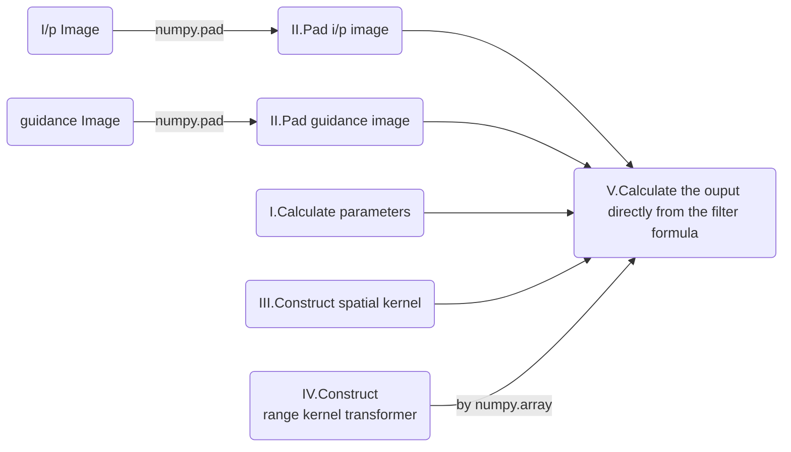
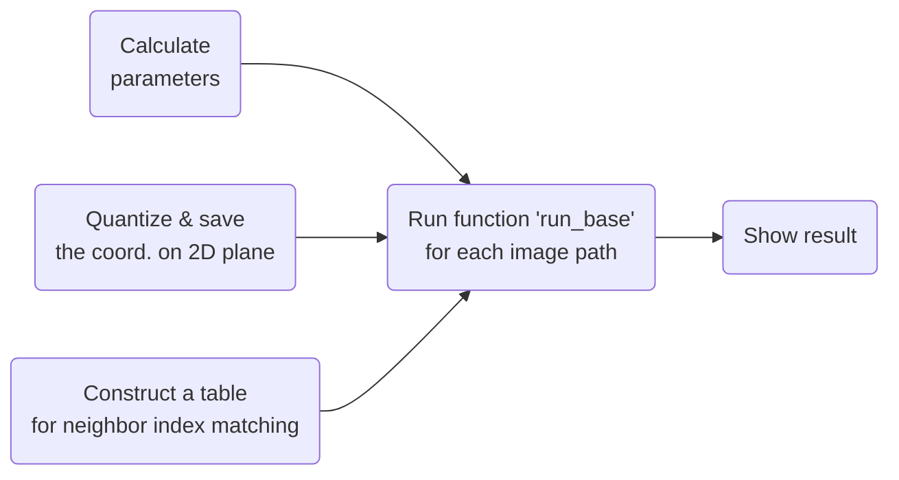
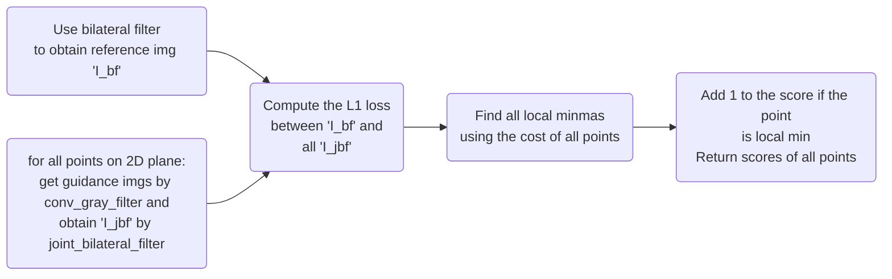

# Computer Vision Project 01

NTUEE, Wan-Cyuan Fan B04502105 	

[toc]

## Design the joint bilateral filter

- ### Flowchart


Range kernel transformer : 
```python
def kernel_r_transform(self, x):
	return np.exp(-x / 255. * x / 255. * self.factor_r)
# x / 255 : because pixel values of the guidance image are between 0 and 255.
```
Example for calculating the convolution ( RGB guidance image )
```python
for y in range(0, h):
  for x in range(0, w):
 	wgt = self.kernel_r_transform(G_pad[y:y + window_size, x:x + window_size, 0] - G_pad[y+r, x+r, 0]) * \
  	self.kernel_r_transform(G_pad[y:y + window_size, x:x + window_size, 1] - G_pad[y+r, x+r, 1]) * \
  	self.kernel_r_transform(G_pad[y:y + window_size, x:x + window_size, 2] - G_pad[y+r, x+r, 2]) * \
  	kernel_s
  	wacc = np.sum(wgt)

  	output[y, x, 0] = np.sum(wgt * I_pad[y:y + window_size, x:x + window_size, 0]) / wacc
  	output[y, x, 1] = np.sum(wgt * I_pad[y:y + window_size, x:x + window_size, 1]) / wacc
	output[y, x, 2] = np.sum(wgt * I_pad[y:y + window_size, x:x + window_size, 2]) / wacc
```
In the example, We use ''double for loop'' to calculate output value at each pixel. "wgt" is the matrix from $G_r(T_p,T_q)$ and $G_r(T_p,T_q)$ for $q \in \Omega_p$ and "wacc" which is the sum of "wgt" equals to the denominator of $F^T(I)$.

- ### Filter function
	- Given $T$ as the guidance, the bilateral filter is written as : $F^T(I)=\frac{\sum_{q \in \Omega_p}G_s(p,q)G_r(T_p,T_q)I_q}{\sum_{q \in \Omega_p}G_s(p,q)G_r(T_p,T_q)}$
	- If T is a single-channel image : $G_r(T_p,T_q)=e^{-\frac{(T_P-T_q)^2}{2\sigma_r^2}}$
	- If T is a color image : $G_r(T_p,T_q)=e^{-\frac{(T_P^r-T_q^r)^2+(T_P^g-T_q^g)^2+(T_P^b-T_q^b)^2}{2\sigma_r^2}}$

<div style="page-break-after: always;"></div>
## How to implement the local minima selection

- ### Flowchart

Main

```python
    def run(self, img_path_list, output_path):
      num_cores = multiprocessing.cpu_count()
      #self.run_base(img_path_list[2], output_path, parallel_num = 0)
      for idx, path in enumerate(img_path_list):
        self.run_base(path, output_path)

      self.show_result()
      return False
```

Run_base


```python
    def run_base(self, path, output_path):
        print('Processing img \'{}\' ......'.format(path))
        img = cv2.imread(path)
        img_rgb = cv2.cvtColor(img, cv2.COLOR_BGR2RGB)
        scores = [0 for i in range(len(self.points))]
        for s in self.sigma_s:
            for r in self.sigma_r:
                scores = self.run_sigle(scores, img_rgb, s, r)
        # save conv img & result
        img_num = path.split('/')[-1][:2]
        img_type = path.split('/')[-1][2:]
        weight_score_dict = {}
        sort_idx = np.argsort(scores)
        for i in [1,2,3]:
            weight_score_dict[self.points[sort_idx[-1*i]]] = scores[sort_idx[-1*i]]
            img_gray = self.conv_rgb2gray(img_rgb, self.points[sort_idx[-1*i]])
            image_name = img_num + '_y{}'.format(i) + img_type
            self.save_img(img_gray, output_path, image_name)

        self.result.append(weight_score_dict)

        print('Processing img \'{}\' ......done'.format(path))
        return True
```

Run_single : In this part, we have image_rgb, specific $\sigma_s$ and $\sigma_r$. So we can calculate the L1-norm loss for each $(w_r,w_g,w_b)$ pair according to the reference img and find local minmum with the costs & scores.

```python
    def run_sigle(self, scores, img_rgb, sigma_s, sigma_r):
        cost = []
        JBF = Joint_bilateral_filter(sigma_s, sigma_r, border_type='reflect')
        I_bf = JBF.joint_bilateral_filter(img_rgb, img_rgb).astype(np.float64)
        for idx, point in enumerate(tqdm(self.points,desc = "[s:{}, r:{}]".format(sigma_s,sigma_r))):
            guidance = self.conv_rgb2gray(img_rgb, point)
            I_jbf = JBF.joint_bilateral_filter(img_rgb, guidance).astype(np.float64)
            cost.append(np.sum(np.abs(I_bf-I_jbf)))
        # calculate the local min
        for idx in range(len(self.points)):
            neighbors_idx = self.neighbor_idx_tab[idx]
            if cost[idx] <= np.array(cost)[neighbors_idx].min():
                scores[idx] += 1
        return scores
```

<div style="page-break-after: always;"></div>
## Experiment result

| Test data                                                    | 1st                                                          | 2nd                                                          | 3rd                                                          |
| ------------------------------------------------------------ | ------------------------------------------------------------ | ------------------------------------------------------------ | ------------------------------------------------------------ |
| /CV/hw1/testdata/0a.png) | /CV/hw1/save_img/0a_y1.png)$(w_r,w_g,w_b)=(1.,0.,0.)$<br/>$score=9$ | /CV/hw1/save_img/0a_y2.png)$(w_r,w_g,w_b)=(0.,0.,1.)$<br/>$score=9$ | /CV/hw1/save_img/0a_y3.png)$(w_r,w_g,w_b)=(0.9,0.,0.1)$<br/>$score=0$ |
| /CV/hw1/testdata/0b.png) | /CV/hw1/save_img/0b_y1.png)$(w_r,w_g,w_b)=(1.,0.,0.)$<br/>$score=3$ | /CV/hw1/save_img/0b_y2.png)$(w_r,w_g,w_b)=(0.8,0.2,0.)$<br/>$score=3$ | /CV/hw1/save_img/0b_y3.png)$(w_r,w_g,w_b)=(0.7,0.2,0.1)$<br/>$score=2$ |
| /CV/hw1/testdata/0c.png) | /CV/hw1/save_img/0c_y1.png)$(w_r,w_g,w_b)=(1.,0.,0.)$<br/>$score=3$ | /CV/hw1/save_img/0c_y2.png)$(w_r,w_g,w_b)=(0.3,0.4,0.3)$<br/>$score=3$ | /CV/hw1/save_img/0c_y3.png)$(w_r,w_g,w_b)=(0.3,0.5,0.2)$<br/>$score=3$ |

- ### Result (Gray Image)

| Input      | /CV/hw1/testdata/0a.png) | /CV/hw1/testdata/0b.png) | /CV/hw1/testdata/0c.png) |
| ---------- | ------------------------------------------------------------ | ------------------------------------------------------------ | ------------------------------------------------------------ |
| Gray Image | /CV/hw1/save_img/0a_gray.png) | /CV/hw1/save_img/0b_gray.png) | /CV/hw1/save_img/0c_gray.png) |

## Other comments
<Note> In this project, we give two different files which are adv_rgb2gray_seq.py and  adv_rgb2gray_parallel.py for advance rgb2gray processing. In adv_rgb2gray_seq.py, we run all programs one by one and it takes about 2~3 hours. Thank for the module 'joblib' in python. we use it in adv_rgb2gray_parallel.py with 16 CPUs and nicely it takes only ~30 mins.

